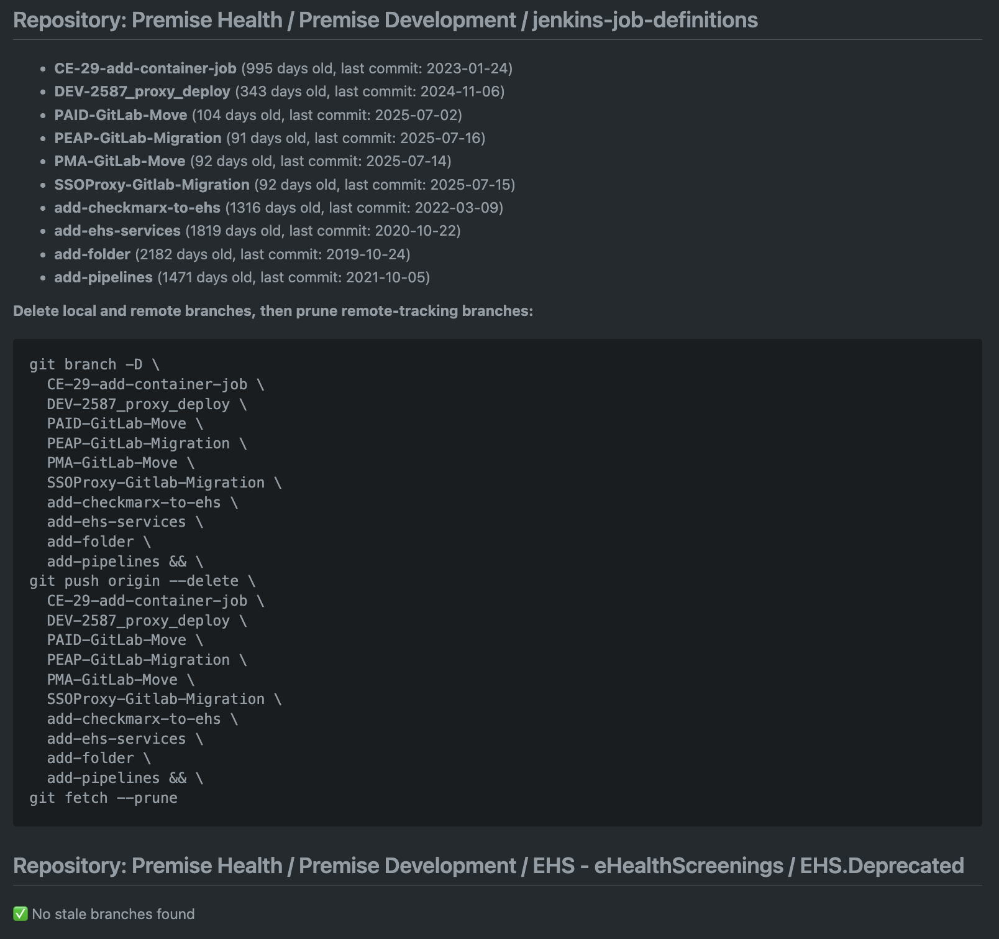

# Repo Cleanup

This repository contains scripts and reports to help identify and clean up stale branches in your Git repositories.

## Contents

- `stale.sh`: Shell script to generate stale branch reports.
- `reports/`: Directory containing markdown reports of stale branches.

## Usage


Run the script with various options to customize the report:

### Help Menu

You can display usage instructions and options by running:

```bash
./stale.sh --help
```

This will print a help menu describing all available options, defaults, and examples.

```bash
# Basic usage (default: 90 days, terminal output, default group: premise-health/premise-development, group ID: 109214032)
./stale.sh

# Specify days threshold (e.g., branches older than 120 days)
./stale.sh 120

# Output as markdown report (saved in reports/)
./stale.sh --markdown

# Combine options (e.g., markdown report for branches older than 60 days)
./stale.sh --markdown 60
```

- `days_threshold`: Number of days to consider a branch stale (default: 90)
- `group_id`: GitLab group ID or path (default: premise-health/premise-development, group ID: 109214032)
- `--markdown`: Output results to a timestamped markdown file in the `reports/` directory

### Example Output

<div style="display: flex; gap: 16px; align-items: flex-start;">
	<div style="flex: 1; text-align: center;">
		<strong>Terminal Output:</strong><br>
		
	</div>
	<div style="flex: 1; text-align: center;">
		<strong>Markdown Report Output:</strong><br>
		
	</div>
</div>

## Requirements

- Git installed and accessible in your PATH
- [jq](https://stedolan.github.io/jq/) (JSON processor) installed and accessible in your PATH
- [glab](https://github.com/profclems/glab) (GitLab CLI) installed and accessible in your PATH

## Contributing

Feel free to submit issues or pull requests to improve the scripts or reporting process.

## License

MIT License
